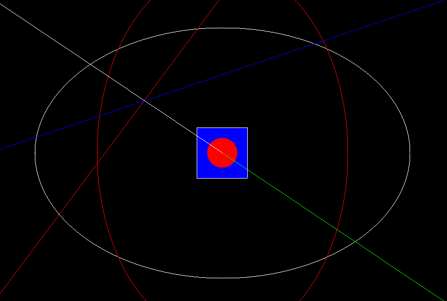
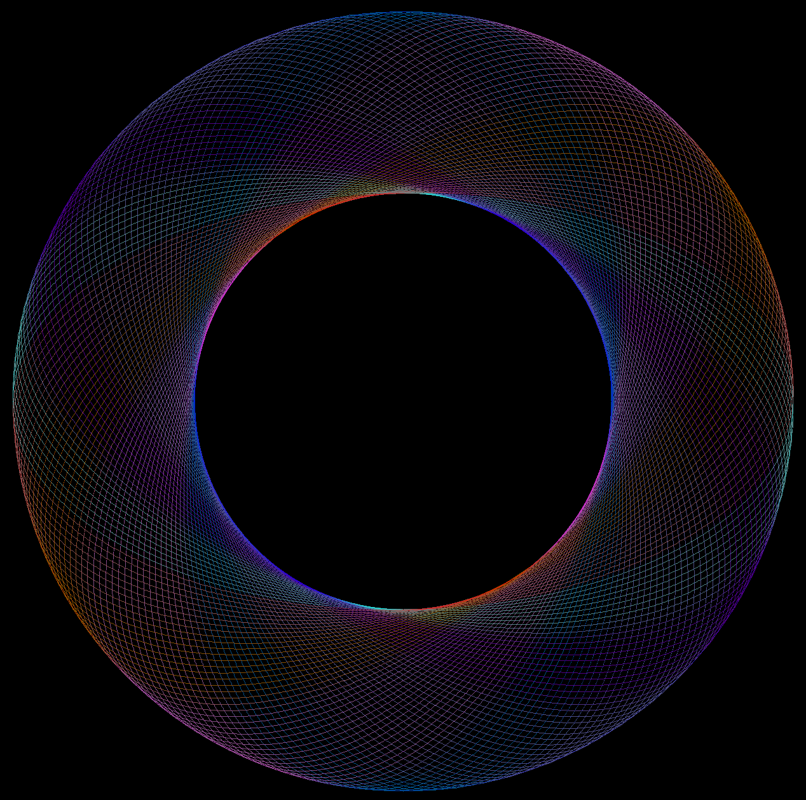
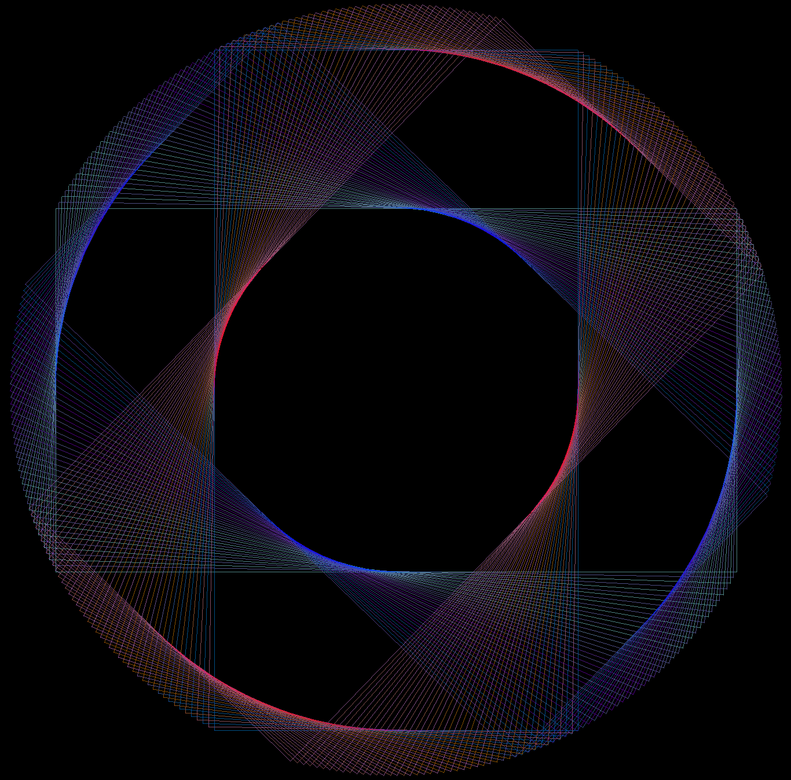
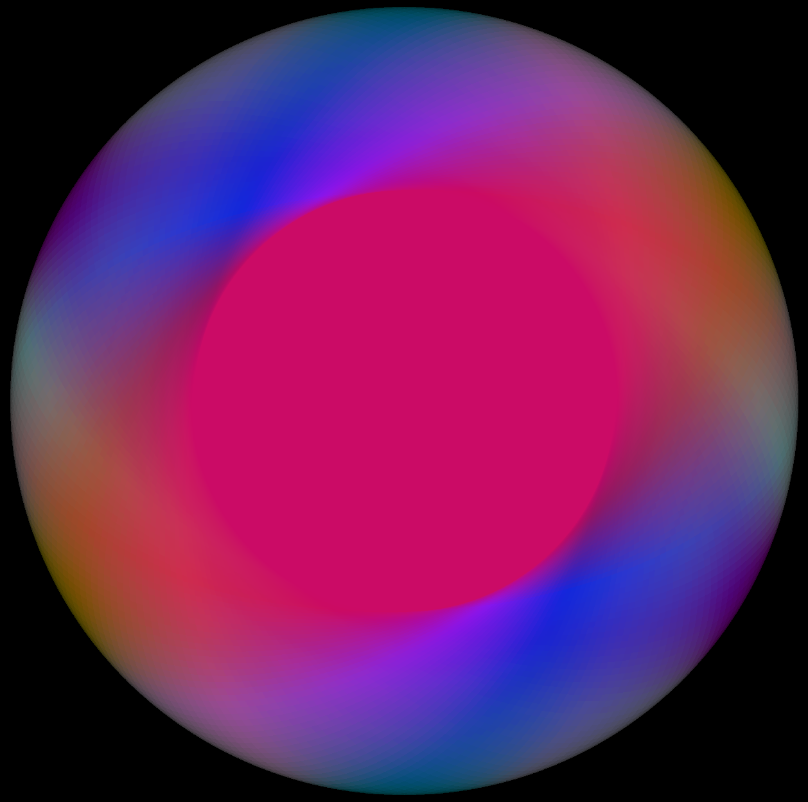

# RustyTree

A simple 2D Canvas Api based on pixels and winit.

# Examples

## Beautiful Ellipses
```
    buffer.clear(0);

    let (a, b) = (
        (buffer.get_width() as f64 * 0.24) as u32,
        (buffer.get_height() as f64 * 0.24) as u32,
    );

    let center = Vector::zero();
    for deg in (0..360).step_by(2) {
        let deg = deg as f64;
        buffer.set_draw_color(Color::new_hsva(
            (deg * 255.0 / 360.0).round() as u8,
            255,
            255,
            100,
        ));
        buffer.draw_ellipse(&center, a, b, deg);
    }
```


## Defect Rectangles
Created by imperfections in the `draw_rect` function
```
    buffer.clear(0);

    let (a, b) = (
        (buffer.get_width() as f64 * 0.23) as u32,
        (buffer.get_height() as f64 * 0.23) as u32,
    );

    let center = Vector::zero();
    for deg in (0..360).step_by(2) {
        let deg = deg as f64;
        buffer.set_draw_color(Color::new_hsva(
            (deg * 255.0 / 360.0).round() as u8,
            255,
            255,
            100,
        ));
        buffer.draw_rect(&center, a * 2, b * 2, deg);
    }
```


## Filled Ellipses
```
    let (a, b) = (
        (buffer.get_width() as f64 * 0.24) as u32,
        (buffer.get_height() as f64 * 0.24) as u32,
    );

    let center = Vector::zero();
    for deg in (0..360).step_by(2) {
        let deg = deg as f64;
        buffer.set_fill_color(Color::new_hsva(
            (deg * 255.0 / 360.0).round() as u8,
            255,
            255,
            10,
        ));
        buffer.fill_ellipse(&center, a * 2, b * 2, deg);
    }
```


## Ellipses and Rectangles
```
    buffer.clear(0);

    let (a, b) = (
        (buffer.get_width() as f64 * 0.23) as u32,
        (buffer.get_height() as f64 * 0.23) as u32,
    );

    let center = Vector::zero();
    for deg in (0..180).step_by(2) {
        let deg = deg as f64;
        buffer.set_draw_color(Color::new_hsva(
            (deg * 255.0 / 180.0).round() as u8,
            255,
            255,
            100,
        ));
        buffer.draw_rect(&center, a * 2, b * 2, deg);
        buffer.draw_ellipse(&center, a, b, deg);
    }
```
