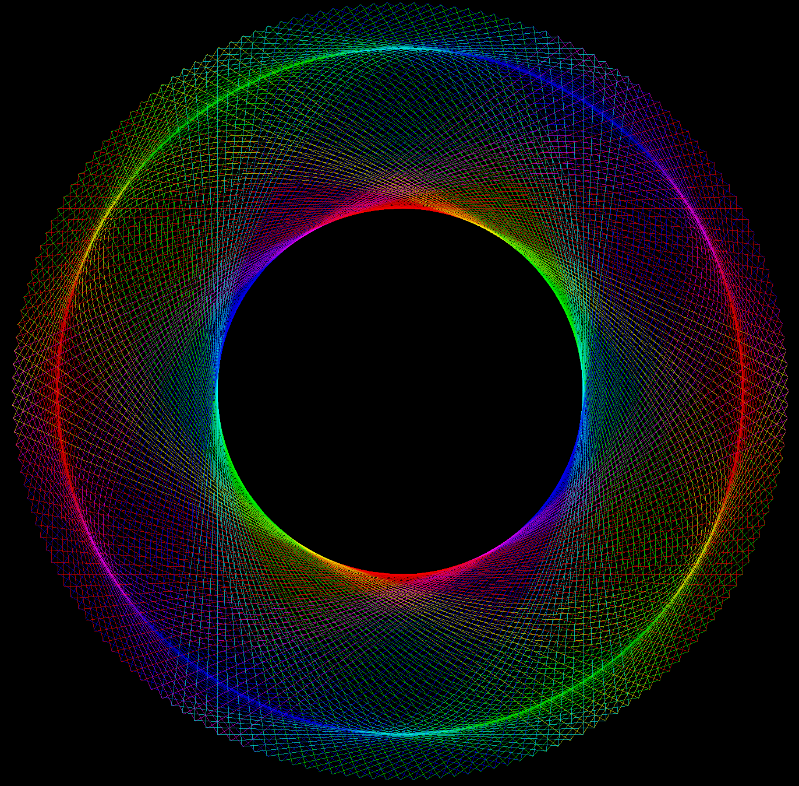
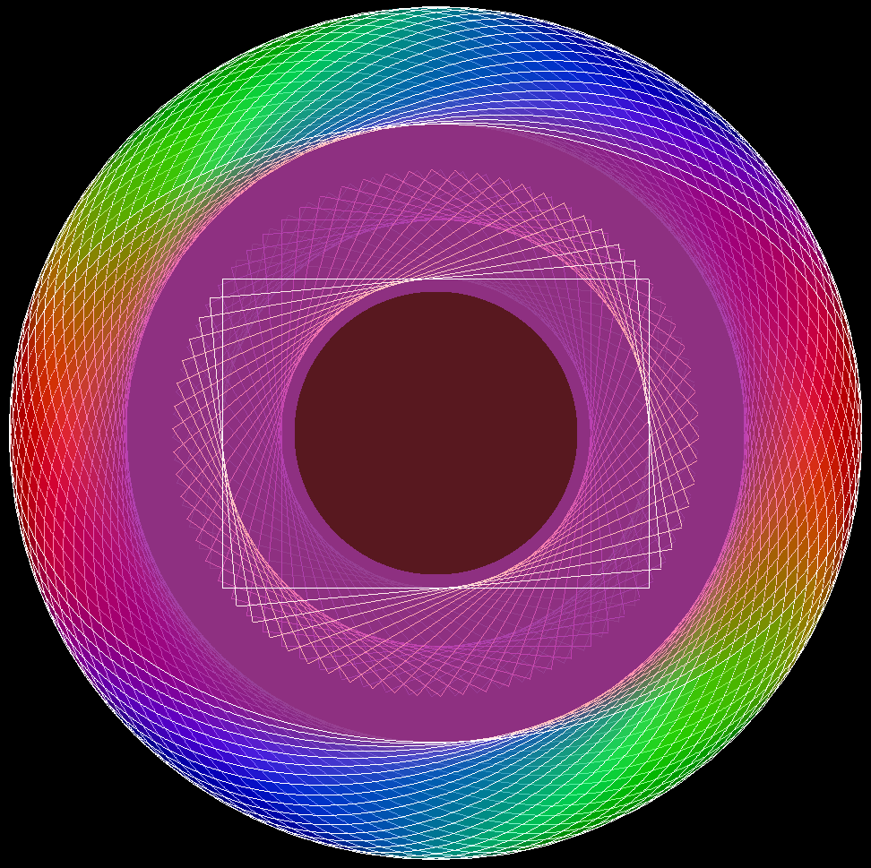
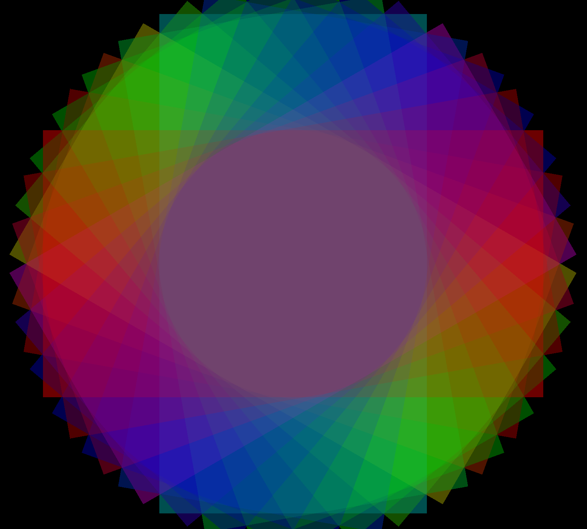
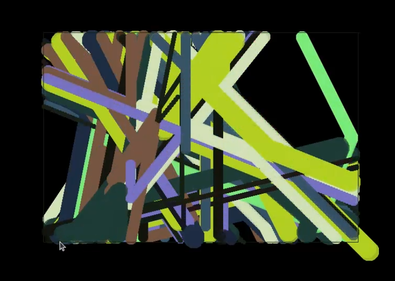

# RustyTree

A simple 2D Canvas Api based on the `pixels` and `winit` crates.

# Examples

## Beautiful Ellipses
```
    buffer.clear(0);

    let (a, b) = (
        (buffer.get_width() as f64 * 0.24) as u32,
        (buffer.get_height() as f64 * 0.24) as u32,
    );

    let center = Vector::zero();
    for deg in (0..360).step_by(2) {
        let deg = deg as f64;
        buffer.set_draw_color(Color::new_hsva(
            (deg * 255.0 / 360.0).round() as u8,
            255,
            255,
            100,
        ));
        buffer.draw_ellipse(&center, a, b, deg);
    }
```


## Defect Rectangles
Created by imperfections in the `Renderer::draw_rect` function during develepoment. Rectangles with specific rotation angles just disappeared.


## Filled Ellipses
```
    let (a, b) = (
        (buffer.get_width() as f64 * 0.24) as u32,
        (buffer.get_height() as f64 * 0.24) as u32,
    );

    let center = Vector::zero();
    for deg in (0..360).step_by(2) {
        let deg = deg as f64;
        buffer.set_fill_color(Color::new_hsva(
            (deg * 255.0 / 360.0).round() as u8,
            255,
            255,
            10,
        ));
        buffer.fill_ellipse(&center, a * 2, b * 2, deg);
    }
```


## Ellipses and Rectangles
```
    buffer.clear(0);

    let (a, b) = (
        (buffer.get_width() as f64 * 0.23) as u32,
        (buffer.get_height() as f64 * 0.23) as u32,
    );

    let center = Vector::zero();
    for deg in (0..180).step_by(2) {
        let deg = deg as f64;
        buffer.set_draw_color(Color::new_hsva(
            (deg * 255.0 / 180.0).round() as u8,
            255,
            255,
            100,
        ));
        buffer.draw_rect(&center, a * 2, b * 2, deg);
        buffer.draw_ellipse(&center, a, b, deg);
    }
```


## Rotation Collection
```
    buffer.clear(0);

    let (a, b) = (
        (buffer.get_width() as f64 * 0.35) as u32,
        (buffer.get_height() as f64 * 0.35) as u32,
    );

    buffer.set_draw_color(Color::from_str("white"));
    let center = Vector::zero();
    for deg in (0..=180).step_by(5) {
        let deg = deg as f64;
        buffer.set_fill_color(Color::new_hsva(
            (deg * 255.0 / 180.0).round() as u8,
            255,
            255,
            20,
        ));
        buffer.fill_ellipse(&center, a, b, deg);
        buffer.draw_ellipse(&center, a, b, deg);
        buffer.draw_rect(&center, a, b, deg);
    }
    buffer.set_fill_color(Color::from_str("whine_red"));
    buffer.fill_ellipse(&center, a / 3, a / 3, 0.0);
```


## Filled Rectangles
```
    buffer.clear(0);

    let (a, b) = (
        (buffer.get_width() as f64 * 0.25) as u32,
        (buffer.get_height() as f64 * 0.25) as u32,
    );

    buffer.set_draw_color(Color::from_str("red"));
    let center = Vector::zero();
    for deg in (0..=180).step_by(10) {
        let deg = deg as f64;
        buffer.set_fill_color(Color::new_hsva(
            (deg * 255.0 / 180.0).round() as u8,
            255,
            255,
            20,
        ));
        buffer.fill_rect(&center, a*2, b*2, deg);
    }
```


# Future Plans

## Collision

Collision is cool, we need it. Infrastructure stands just the real implementation is needed.

### What to avoid
Bad collision should be avoided at all costs. See the following picture as an example of bad collision:

